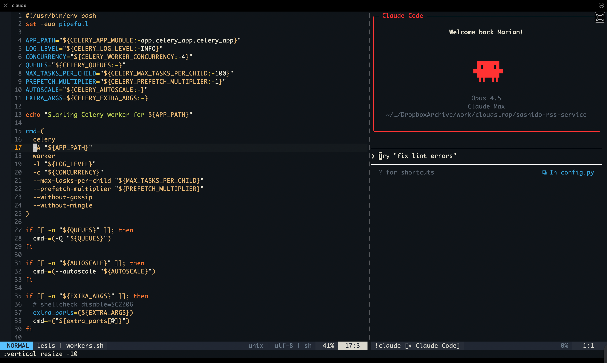

# Vimsor

> A Cursor/Sublime-like Vim configuration with Claude AI integration

Turn Vim into a modern AI-powered code editor with fuzzy finding, multi-cursor editing, and Claude Code integration - all in your terminal.



## Features

- **Claude AI Integration** - Chat with Claude, explain code, fix bugs, rewrite selections
- **Sublime-like Keybindings** - Familiar shortcuts (`Ctrl+P`, `Ctrl+B`, `Ctrl+/`)
- **Multi-cursor Editing** - Select and edit multiple occurrences (`Ctrl+N`)
- **Fuzzy File Finder** - Quick file navigation with fzf
- **Git Integration** - Branch in status line, git gutter, fugitive commands
- **Modern UI** - Ayu theme, custom status line with icons
- **Fast** - Optimized for speed, lazy-loaded plugins

## Quick Start

### One-line Install (macOS/Linux)

```bash
curl -fsSL https://raw.githubusercontent.com/mignev/vimsor/main/install.sh | bash
```

### Manual Install

```bash
# Clone the repo
git clone https://github.com/mignev/vimsor.git ~/.vimsor

# Run install script
~/.vimsor/install.sh
```

## Requirements

- Vim 8.0+ or Neovim
- Git
- [fzf](https://github.com/junegunn/fzf) - Fuzzy finder
- [ripgrep](https://github.com/BurntSushi/ripgrep) - Fast search
- [Claude Code](https://claude.ai/code) (optional) - AI features

## Keybindings

Leader key: `,`

### File Navigation

| Key | Action |
|-----|--------|
| `Ctrl+P` | Fuzzy file finder |
| `Ctrl+B` | Toggle sidebar |
| `,f` | Search in project |
| `,P` | Command palette |

### Claude AI

| Key | Action |
|-----|--------|
| `,cc` | Open Claude chat (side panel) |
| `,ce` | Explain current file |
| `,ca` | Ask about selection |
| `,cr` | Rewrite selection |
| `,cf` | Fix bugs in selection |

### Editing

| Key | Action |
|-----|--------|
| `Ctrl+S` | Save |
| `Ctrl+N` | Multi-cursor (select next match) |
| `,/` | Toggle comment |
| `,d` | Duplicate line |
| `Alt+Up/Down` | Move line |

### Navigation

| Key | Action |
|-----|--------|
| `Ctrl+J/K` | Fast scroll (5 lines) |
| `Ctrl+D/U` | Half page down/up |
| `,]` / `,[` | Next/previous tab |
| `Ctrl+W h/j/k/l` | Navigate splits |

[Full Cheatsheet](docs/CHEATSHEET.md)

## Status Line

```
┌──────────────────────────────────────────────────────────────────┐
│ NORMAL │ ⑂ master │ » filename.py ● │ ◆ python │ ↕ 50% │ ☰ 10:5 │
└──────────────────────────────────────────────────────────────────┘
```

| Symbol | Meaning |
|--------|---------|
| ⑂ | Git branch (red) |
| » | File |
| ● | Modified |
| ◆ | File type |
| ↕ | Position % |
| ☰ | Line:Column |

## Plugins

| Plugin | Purpose |
|--------|---------|
| [fzf.vim](https://github.com/junegunn/fzf.vim) | Fuzzy finder |
| [NERDTree](https://github.com/preservim/nerdtree) | File sidebar |
| [vim-visual-multi](https://github.com/mg979/vim-visual-multi) | Multi-cursor |
| [vim-commentary](https://github.com/tpope/vim-commentary) | Comment toggle |
| [vim-surround](https://github.com/tpope/vim-surround) | Surround text |
| [auto-pairs](https://github.com/jiangmiao/auto-pairs) | Auto brackets |
| [vim-fugitive](https://github.com/tpope/vim-fugitive) | Git commands |
| [vim-gitgutter](https://github.com/airblade/vim-gitgutter) | Git diff signs |
| [lightline.vim](https://github.com/itchyny/lightline.vim) | Status line |
| [ayu-vim](https://github.com/ayu-theme/ayu-vim) | Color scheme |
| [vim-polyglot](https://github.com/sheerun/vim-polyglot) | Language pack |

## Customization

### Change Color Scheme

Edit `~/.vimrc` and change:

```vim
let ayucolor="mirage"  " Options: light, mirage, dark
```

### Change Leader Key

```vim
let mapleader = ","  " Change to your preference
```

### Disable Claude Integration

Comment out or remove the Claude section in the vimrc if you don't use Claude Code.

## Updating

```bash
cd ~/.vimsor
git pull
vim +PlugUpdate +qall
```

## Uninstall

```bash
~/.vimsor/uninstall.sh
```

## Contributing

Contributions welcome! Please read [CONTRIBUTING.md](CONTRIBUTING.md) first.

## License

MIT License - see [LICENSE](LICENSE)

## Credits

Created by [Marian Ignev](https://github.com/mignev)

Inspired by:
- [Cursor](https://cursor.sh)
- [Sublime Text](https://www.sublimetext.com)
- [vim-sensible](https://github.com/tpope/vim-sensible)
